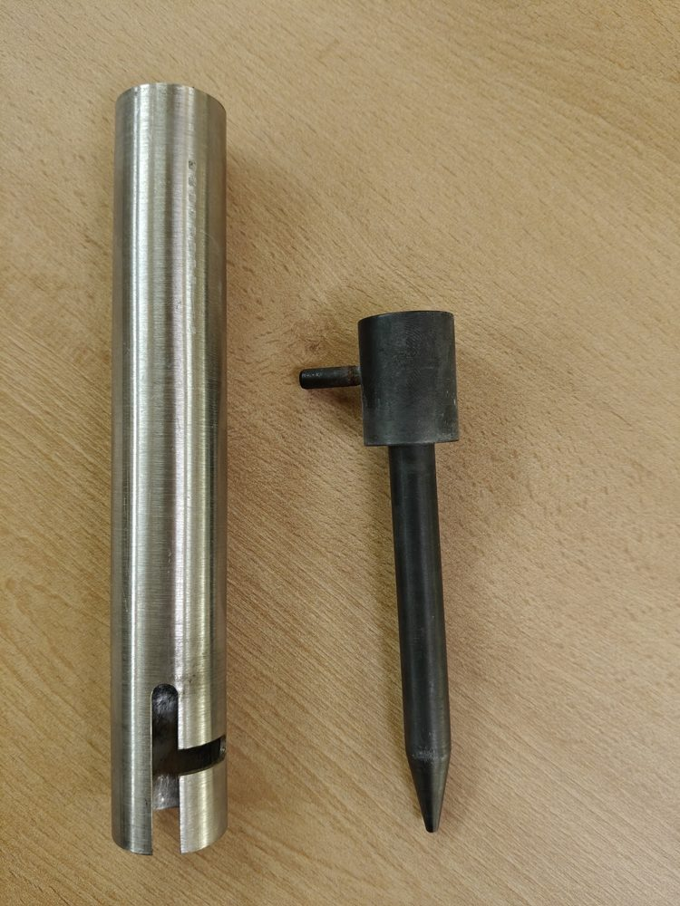

# Gartenfackel: Verbindungsrohr gemeinsam nachbauen

Hier sammeln wir alles, was wir brauchen, um ein vorhandenes Verbindungsrohr für eine Gartenfackel-Vorrichtung nachvollziehbar zu dokumentieren und daraus später einen Fertigungsauftrag zu machen.

**Stand: 28. September 2026 — Ein CAD-Fotoentwurf D02, STEP und ein erster Web-Viewer sind erstellt. Maße sind unbestätigt; drei klassische technische Prüfzeichnungen als A3-PDF sind vorhanden.**

## Viewer D02: beide Teile

D02 zeigt beide Bauteile getrennt oder zusammengesteckt; jedes lässt sich ausblenden. STEP-Downloads enthalten beide Körper oder jeweils ein Einzelteil. Die Montagelage ist eine unbestätigte Annahme, keine geprüfte Verriegelung.

Der Viewer-Code liegt unter [web/](web/), mit Drehen/Zoomen, Ansichten, Schlitzdetail, Transparenz, Referenzfotos, Maßschätzungen und STEP-Download. Alle Browserdateien sind lokal eingebunden. GitHub Pages veröffentlicht den main-Branch; die Startseite führt zum Viewer.

Viewer: https://jdistlr.github.io/garden-torch-connector/

[Starten, neu erzeugen und veröffentlichen](docs/viewer-runbook.md).

## Ab jetzt: ein sichtbares Ergebnis pro Runde

Wir beginnen mit einem **Formabgleich aus Fotos und einer einfachen Skizze**. Danach folgen wenige CAD-Ansichten, ein minimaler drehbarer Web-Viewer und gezielte Maßkorrekturen. Ein früher Entwurf darf klar markierte Foto-Schätzungen enthalten; er ist nicht fertigungsfreigegeben.

Der erste Viewer bekommt nur Drehen/Zoomen, Ansicht zurücksetzen und eine Infobox mit Maßen und Status. Schnitte und weitere Panels folgen schrittweise. Pro Runde klären wir höchstens drei konkrete Fragen. Siehe [kurzer Projektplan](docs/plan.md) und [wiederverwendbarer Ablauf](docs/workflow.md).

## Neu dabei? Hier anfangen

Du brauchst zum Mitlesen keine CAD-Software und musst nichts installieren. Dieses Repository ist unser gemeinsamer Projektordner mit nachvollziehbarer Änderungshistorie. Die README ist seine Startseite.

1. Schau dir unten das Bauteil und die [Bildübersicht](sources/README.md) an.
2. In der [Maßliste](docs/measurements.md) steht, was wir noch messen und klären müssen.
3. Der [Projektplan](docs/plan.md) beschreibt den Weg bis zum Auftragspaket.

## Um welches Teil geht es?

Im Mittelpunkt steht das **Metallrohr mit einem offenen Längsschlitz und einer seitlichen Aussparung**. Auf den Fotos liegt daneben ein Erdspieß mit einem dickeren Kopf und einem seitlich herausstehenden Stift.

*Originalbauteile, noch kein CAD-Rendering.*

Der Stift scheint im Schlitz geführt und durch Verdrehen in die seitliche Aussparung bewegt zu werden. **Diese Steck-Dreh-Funktion ist bisher eine Interpretation der Fotos und muss am Bauteil bestätigt werden.**

**Der Projektumfang umfasst beide Teile:** das geschlitzte Rohr und das schwarze Gegenstück mit Kopf, Schaft, Spitze und radialem Stift. Die frühere Beschränkung auf das Rohr war falsch und ist mit D02 korrigiert. Wie die Fackel am anderen Rohrende befestigt wird, ist noch zu klären.

## Was ist schon erledigt?

| Bestandteil | Stand |
|---|---|
| Bilder sichten und zuordnen | Erledigt: 16 Dateien, davon 14 unterschiedliche Fotos |
| Bildübersicht im Repository | Vorhanden |
| Projektplan und Werkzeugvorschlag | Vorhanden |
| Maßliste und offene Fragen | Vorhanden |
| Maße verbindlich bestätigen | Offen |
| Änderbares 3D-Modell erstellen | D02 als unbestätigter Foto-Entwurf vorhanden |
| Bemaßte Zeichnung und STEP-Datei | STEP und drei bemaßte Prüfzeichnungen als A3-PDF vorhanden |
| Auftragspaket für einen Fertiger | Geplant |
| Engineering-Web-Viewer mit Informationspanels | Erste statische Version erstellt; Pages-Deployment separat prüfen |

Die Fotos 07 und 12 sind exakte Duplikate von 02 beziehungsweise 03. Im Repository liegen 14 verkleinerte Vorschauen ohne übernommene Kamera-Metadaten. Die hochauflösenden Originale sind hier noch nicht enthalten. Dateinamen und Prüfsummen der Originale stehen im [Quelleninventar](sources/inventory.json).

## Was wollen wir am Ende haben?

- **Ein 3D-Modell**, dessen Maße sich gezielt ändern lassen.
- **Eine technische Zeichnung als PDF**, mit Ansichten, Schnitt und Detail des Schlitzes.
- **Eine STEP-Datei**, mit der ein Fertiger das räumliche CAD-Modell weiterverwenden kann.
- **Einen Engineering-Web-Viewer**, in dem ihr das Modell drehen, schneiden und mit Maß-, Kennwert- und Quellenpanels untersuchen könnt.
- **Anschauliche Modellbilder**, damit Form und Zusammenbau leicht verständlich sind.
- **Eine kurze Auftragsbeschreibung** mit Material, Stückzahl, Oberfläche und abgestimmten Anforderungen.

Ein schönes Modellbild zeigt die Form. Für die Fertigung brauchen wir zusätzlich eindeutige Maße, zulässige Abweichungen und Materialangaben.

## Wie gehen wir vor?

1. **Bestand verstehen:** Fotos zuordnen und die tatsächliche Montagebewegung erklären.
2. **Maße aufnehmen:** Vorhandene Linealfotos auswerten und relevante Werte direkt am Bauteil bestätigen.
3. **Modell aufbauen:** Rohr mit Ausschnitten und schwarzes Gegenstück aus derselben Parameterrevision erzeugen.
4. **Gemeinsam prüfen:** Passen Aussparung, Stift, Drehrichtung und Gegenstück zusammen?
5. **Zeichnung und Auftrag fertigstellen:** Material, Oberfläche, Stückzahl und zulässige Maßabweichungen mit dem Fertiger abstimmen.

Dabei unterscheiden wir immer zwischen **auf dem Foto gesehen**, **aus dem Foto geschätzt**, **gemessen und bestätigt** und **neu entschieden**. So wird eine Schätzung nicht versehentlich zur Fertigungsvorgabe.

## Das Modell im Browser untersuchen

Geplant ist eine Three.js-Ansicht mit technischen Standardansichten, sichtbaren Kanten, Transparenz und einer Schnittebene. Daneben zeigen Panels Maße, Materialvolumen, Modellstand, Bildquellen und offene Punkte. Masse wird erst bei bekanntem Material und bekannter Dichte berechnet.

Das Browserbild wird aus dem CAD-Modell abgeleitet. Verbindliche Maße und Kennwerte stammen aus der CAD-Geometrie; ein angeklicktes Dreieck im Browser wäre nur eine Näherung. Die erste Version ist gebaut; Schnittfunktion und freie Messungen sind noch nicht enthalten. [Funktionen und Qualitätsanforderungen](docs/web-viewer.md) sind jetzt dokumentiert.

## Was könnt ihr jetzt beitragen?

Für die erste Runde bitte diese fünf Werte in **Millimetern** aufnehmen:

| Maß | Was genau messen? |
|---|---|
| Rohrlänge | Von einer Stirnfläche bis zur anderen |
| Außendurchmesser | Außen über das Rohr, möglichst an mehreren Stellen |
| Innendurchmesser | Die Öffnung am ungeschlitzten Ende |
| Schlitzbreite | Abstand zwischen den geraden Schlitzseiten |
| Gesamte Schlitztiefe | Vom geschlitzten Rohrende bis zum entferntesten Punkt der Rundung |

Durchmesser und Schlitzbreite möglichst mit einem Messschieber messen. Die seitliche Aussparung und das Gegenstück erfassen wir anschließend nach der [ausführlichen Maßliste](docs/measurements.md).

Zum Durchgeben reicht beispielsweise diese Vorlage:

> Rohrlänge: … mm  
> Außendurchmesser: … mm  
> Innendurchmesser: … mm  
> Schlitzbreite: … mm  
> Gesamte Schlitztiefe: … mm  
> Messmittel: …  
> Gemessen am: …

Zusätzlich helfen Antworten auf diese Fragen:

- Soll das Rohr exakt nachgebaut oder verändert werden?
- Wie wird die Verbindung zusammengesteckt, verdreht und wieder gelöst?
- Was sitzt am anderen Rohrende?
- Welches Material und wie viele Stück werden gewünscht?

Ihr könnt Maße und Erläuterungen im gemeinsamen Chat durchgeben. Wer einen GitHub-Account hat, kann auch unter [Issues](https://github.com/jdistlr/garden-torch-connector/issues) eine Frage oder Messung festhalten. Bitte das zugehörige Foto beziehungsweise Bauteil nennen. Zum bloßen Mitlesen braucht ihr beim aktuell öffentlichen Repository keinen Account.

## Welche Werkzeuge sind vorgesehen?

| Werkzeug | Einfach erklärt |
|---|---|
| **CadQuery** | Erstellt das 3D-Modell aus einem Programm und einer Maßtabelle. Eine Maßänderung kann dadurch in das Modell übernommen werden. |
| **FreeCAD mit TechDraw** | Öffnet CAD-Modelle und hilft, technische Zeichnungen daraus abzuleiten. |
| **GitHub** | Bewahrt Dateien, Entscheidungen und Änderungen gemeinsam auf. |

CadQuery ist als zentrale Modellquelle vorgesehen. Ein zusätzlicher MCP-Server ist für diesen dateibasierten Ablauf zunächst nicht nötig. CadQuery 2.7.0 erzeugt den Entwurf; gültiger Körper und STEP-Rückimport sind geprüft. FreeCAD/TechDraw ist noch nicht eingerichtet.

Die Begründung und offiziellen Dokumentationslinks stehen in der [Werkzeugentscheidung](docs/toolchain.md).

## Wo finde ich was?

| Datei oder Ordner | Inhalt |
|---|---|
| [sources/README.md](sources/README.md) | Bildübersicht mit festen Bildnummern |
| [sources/inventory.json](sources/inventory.json) | Original-Dateinamen, Prüfsummen und Duplikatzuordnung |
| [docs/plan.md](docs/plan.md) | Arbeitsschritte und Kriterien für den Abschluss |
| [docs/measurements.md](docs/measurements.md) | Ausführliche Maßliste und Funktionsfragen |
| [docs/toolchain.md](docs/toolchain.md) | Werkzeugwahl und geplante Dateiformate |
| [docs/web-viewer.md](docs/web-viewer.md) | Browseransicht, Informationspanels und Qualitätsanforderungen |
| [parameters/connector.json](parameters/connector.json) | Vorbereitete Maßtabelle für das spätere Modell |

In der Parameterdatei bedeutet `null`: **noch unbekannt**, nicht null Millimeter.

## Freigabe und Veröffentlichung

Das Repository ist derzeit **öffentlich**. Die erste interaktive 3D-Ansicht ist veröffentlicht; GitHub Pages baut Änderungen am main-Branch automatisch.

Aktuell liegt eine **Projektgrundlage, keine Fertigungsfreigabe** vor. Erst wenn relevante Maße, Material, Funktion und Anforderungen geprüft sind, wird ein eindeutig gekennzeichnetes Auftragspaket zusammengestellt.

## Technische Zeichnungen für die Werkstatt

[PDF öffnen: drei A3-Blätter D02](web/assets/werkstattzeichnungen-D02.pdf). Im Viewer direkt durchblätterbar und vergrößerbar; zusätzlich als PDF-Download verfügbar.

1. **GF-01 Rohr:** Vorder- und Stirnansicht, Längen- und Durchmessermaße, Schlitzdetail 3:1.
2. **GF-02 Gegenstück:** Kopf, Schaft, Spitze und Stift, bemaßte Ansicht und Kopfdetail 2:1.
3. **GF-00 Zusammenbau:** illustrative Montagelage, Positionsnummern und Stückliste.

Schwarzweiße Vektorzeichnung mit Maßpfeilen, Mittellinien, verdeckten Kanten und Schriftfeld. Auf A3 bei **100 % / tatsächliche Größe** drucken; 50-mm-Kontrollstrecke nachprüfen. Alle Maßzahlen bleiben unbestätigte Foto-Schätzungen. Material, Passungen, Toleranzen, Rauheit und Fügeverfahren sind offen; die PDF ist keine Fertigungsfreigabe.

[Darstellungsgrundlage und reproduzierbarer Export](docs/drawings.md).

## Sockelvarianten V01

[Zweite Viewerseite: A–D im Vergleich](https://jdistlr.github.io/garden-torch-connector/web/variants.html). Mit CAD-Schnitt, Explosionsansicht, Einzelteilen und STEP-Konzepten. Enthält eigene Zeit-/Budgetspannen und qualitative Einschätzungen zur Verbindung. Neue Geometriemaße sind ausdrücklich Konzeptannahmen; keine Fertigungs- oder Standsicherheitsfreigabe.
