# Bildquellen

16 Originaldateien, 14 unterschiedliche Inhalte. 07 ist bytegleich mit 02; 12 mit 03. Prüfsummen beziehen sich auf die Originale, nicht auf die Vorschauen. Vorschauen: maximal 1000 Pixel Kantenlänge, neu als JPEG gespeichert. Originaldateien bleiben außerhalb dieses Repositories verfügbar; sie wurden nicht verändert.

## 10 — Rohrlänge mit Lineal

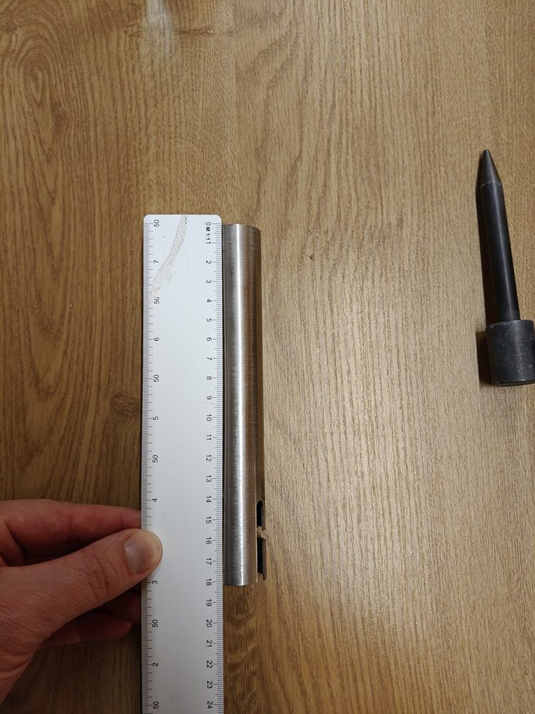

## 11 — Schlitztiefe mit Lineal

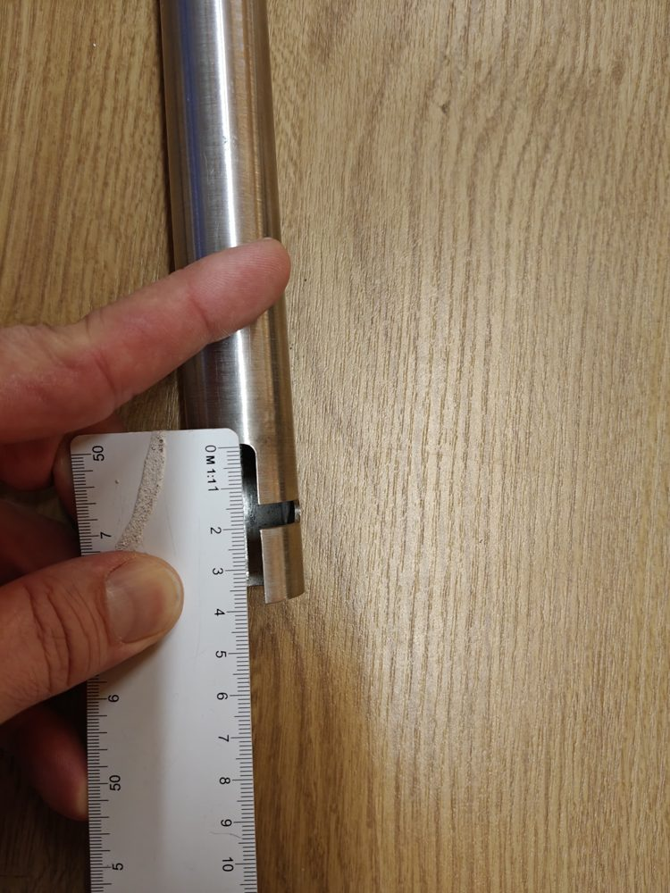

## 13 — Seitliche Aussparung mit Lineal

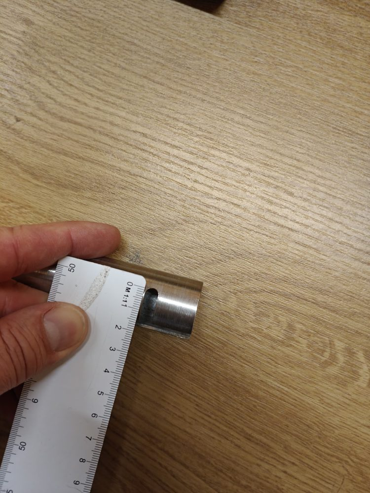

## 14 — Kopflänge mit Lineal

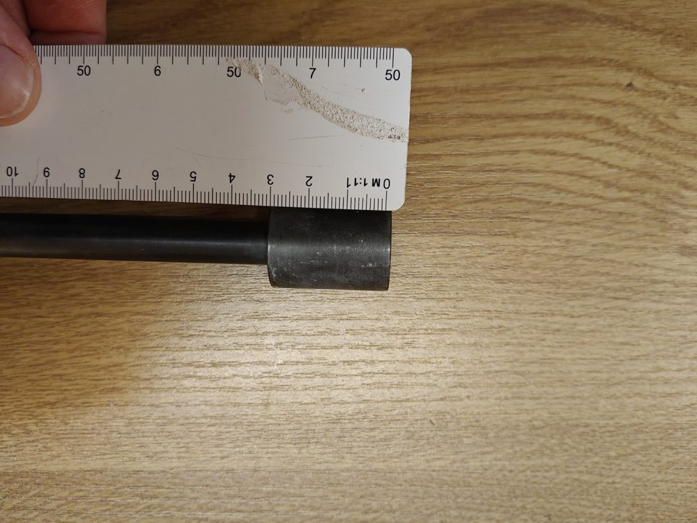

## 15 — Rohr und Ausschnitt ohne Gegenstück

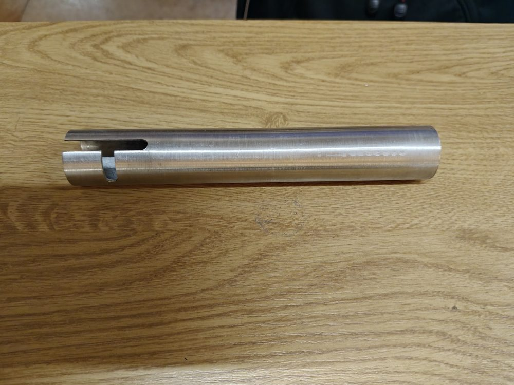

## 16 — Kopf mit Lineal aus weiterer Ansicht

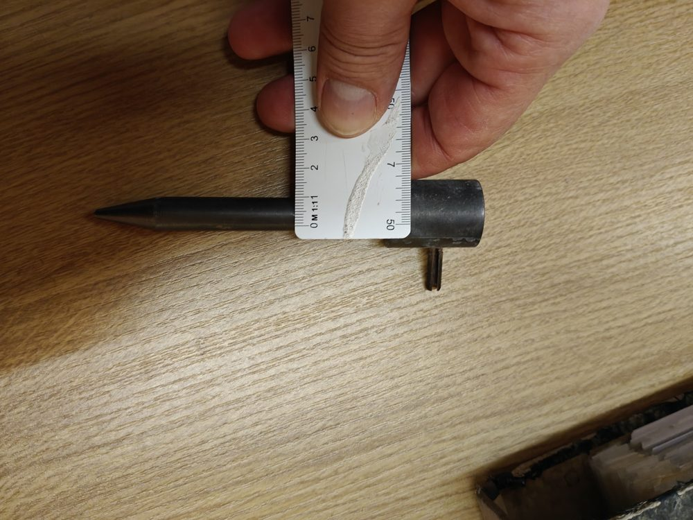

## 01 — Montiertes Rohr und Stift

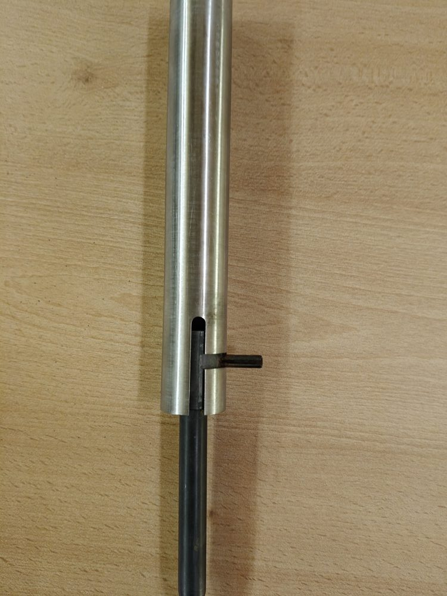

## 02 — Separater Erdspieß

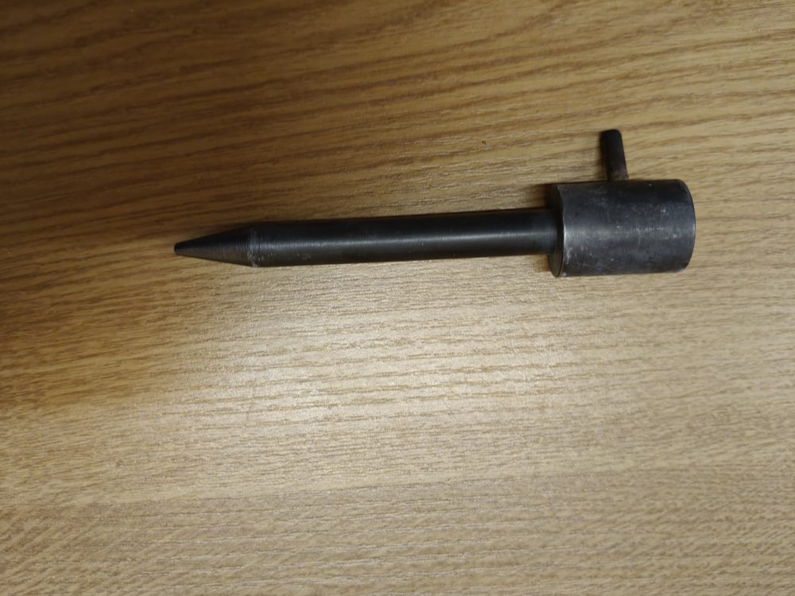

## 03 — Kopf mit Lineal

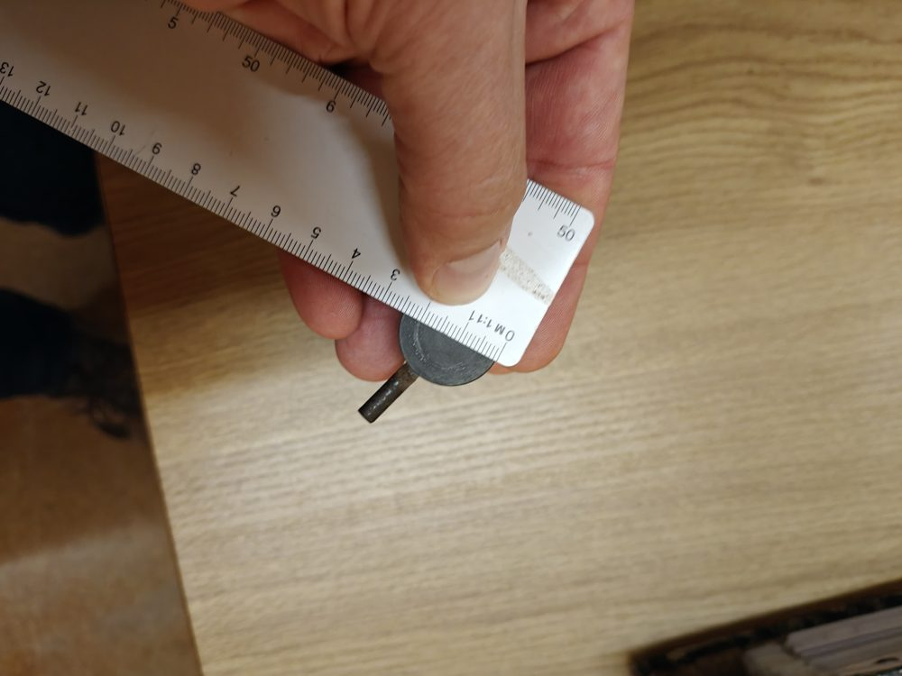

## 04 — Schlitzbereich mit Lineal

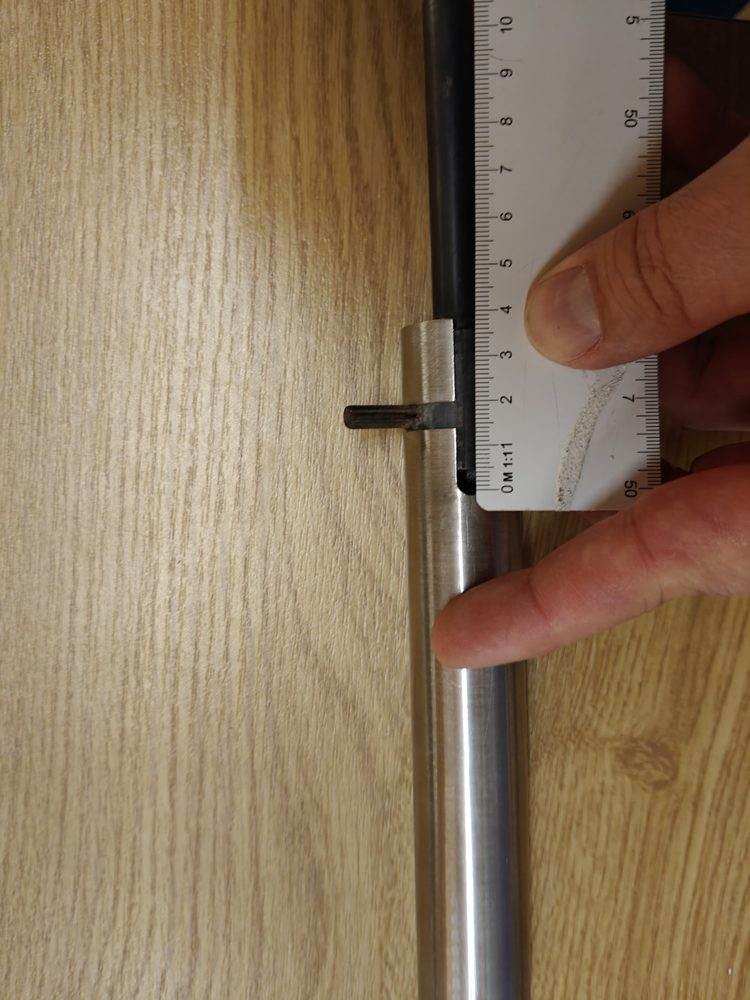

## 05 — Rohrstirnseite mit Lineal

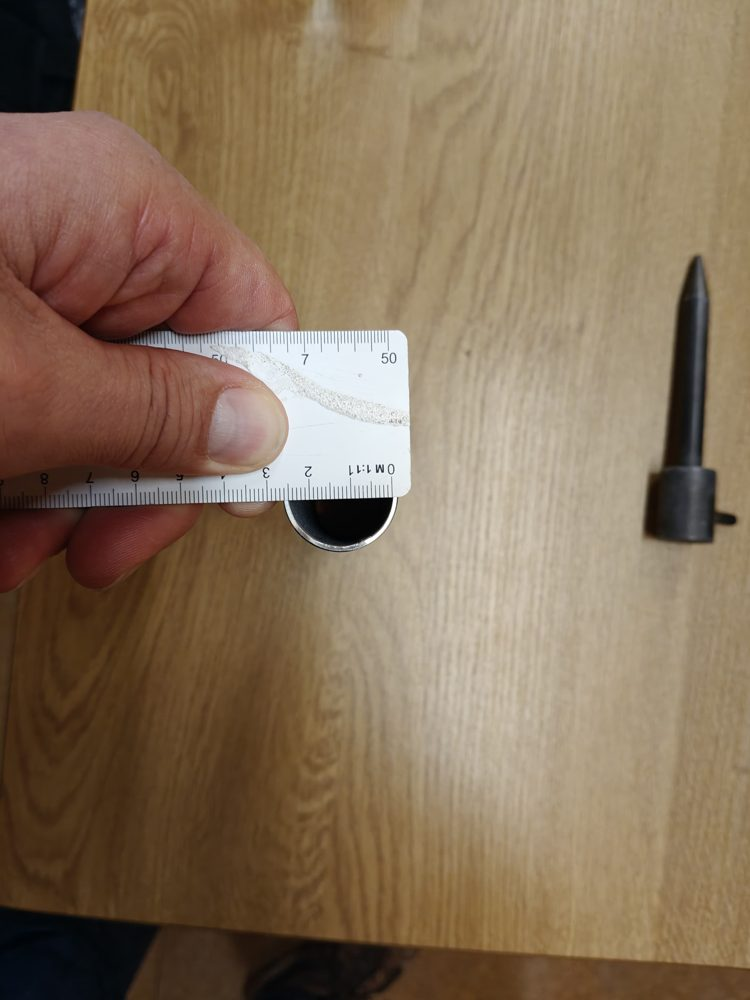

## 06 — Rohr und Erdspieß nebeneinander

## 08 — Erdspieß mit Längenvergleich

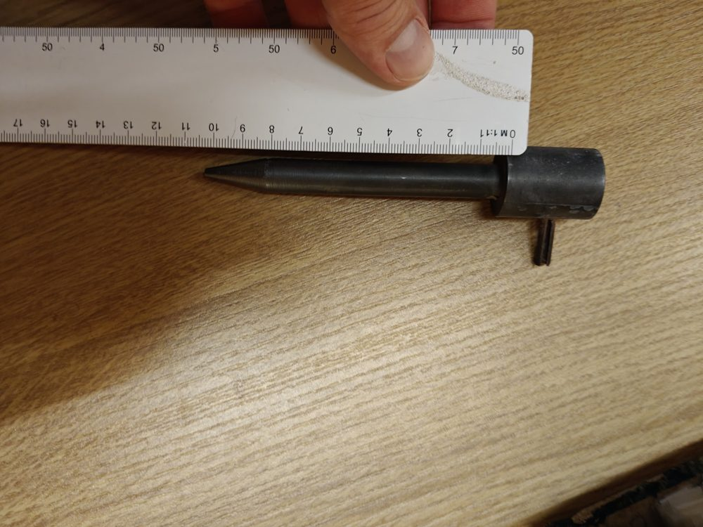

## 09 — Radialer Stift mit Lineal

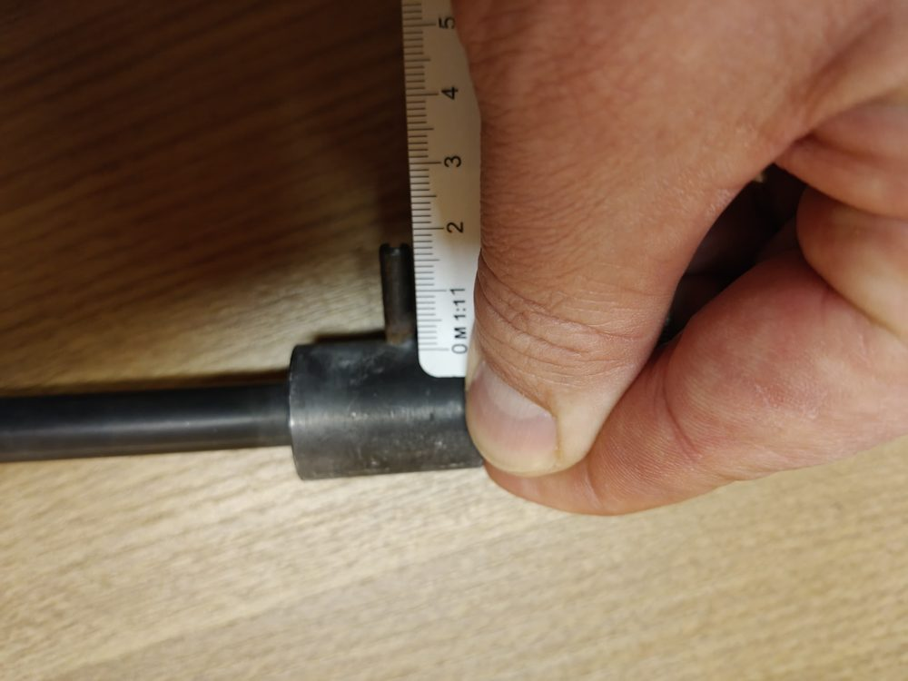
